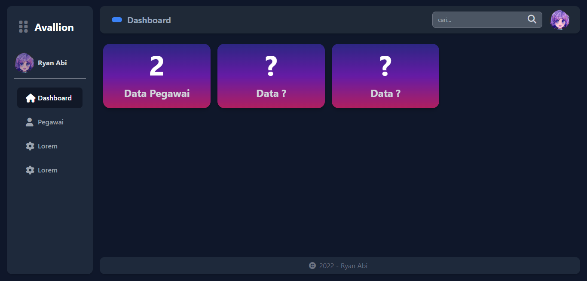

# Website Sistem Data Pegawai

Demo : https://avallion.000webhostapp.com/

### Resources
-  Codeigniter 3
-  TailwindCSS
-  Flowbite
-  Fontawesome icons

### How to run in localhost

1. clone project in directoy htdocs xampp
```
git clone https://github.com/ryanabi-RA/Project-clone-app-KAI.git
```

2. running apache and mysql in xampp or etc.

3. import file database sql to phpmyadmin or etc.
```
http://localhost/phpmyadmin/index.php
```

4. run project in browser
```
http://localhost/dashboard-pegawai
```

## Screenshots




